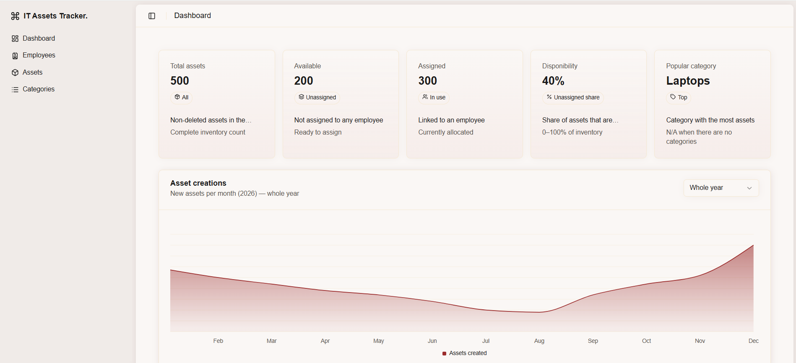

# IT Assets Tracker

> **Live app:** [https://vueitassetstracker.vercel.app](https://vueitassetstracker.vercel.app)

---



---

## Overview

IT Assets Tracker is a web application for managing a company's IT inventory. It lets you track physical assets (laptops, monitors, peripherals, etc.), assign them to employees, and monitor availability at a glance through a real-time dashboard.

**Key capabilities:**

- Full CRUD management of **Assets**, **Employees**, and **Categories**
- Assign and unassign assets to employees
- Dashboard with availability metrics and an asset-creation trend chart
- Instant feedback via toast notifications on every operation
- Filterable, sortable, paginated data tables across all modules

## Tech Stack

| Layer             | Technology                               |
| ----------------- | ---------------------------------------- |
| Framework         | Vue 3 (Composition API) + Vite           |
| Styling           | Tailwind CSS 4 + shadcn-vue (Reka UI)    |
| Server state      | TanStack Query v5                        |
| Forms             | VeeValidate + Zod                        |
| Tables            | TanStack Table v8                        |
| API client        | Auto-generated OpenAPI TypeScript client |
| Unit tests        | Vitest + Vue Test Utils                  |
| E2E tests         | Playwright                               |
| Component catalog | Storybook 10                             |

## API

All data is served by a dedicated REST API built with NestJS, deployed at:

```
https://api-hs-2026.onrender.com/api
```

The OpenAPI client (`/src/api-client`) is auto-generated from the API schema, providing fully typed request/response models.

> **Note:** The API is hosted on Render's free tier and may take up to 60 seconds to wake from sleep on first request.

## Getting Started

**Prerequisites:** Node.js 20+, pnpm.

```bash
# Install dependencies
pnpm install

# Start the development server
pnpm dev
```

Open [http://localhost:5173](http://localhost:5173) in your browser.

## Scripts

| Script                 | Description                                        |
| ---------------------- | -------------------------------------------------- |
| `pnpm dev`             | Start the development server                       |
| `pnpm build`           | Type-check and create a production build           |
| `pnpm preview`         | Serve the production build locally                 |
| `pnpm lint`            | Run ESLint                                         |
| `pnpm lint:fix`        | Run ESLint and auto-fix issues                     |
| `pnpm format`          | Check formatting with Prettier                     |
| `pnpm format:fix`      | Auto-format all files                              |
| `pnpm test`            | Run unit and component tests with Vitest           |
| `pnpm coverage`        | Run tests with coverage report                     |
| `pnpm test:e2e`        | Run Playwright end-to-end tests                    |
| `pnpm storybook`       | Start the Storybook component catalog on port 6006 |
| `pnpm build-storybook` | Build a static Storybook export                    |
